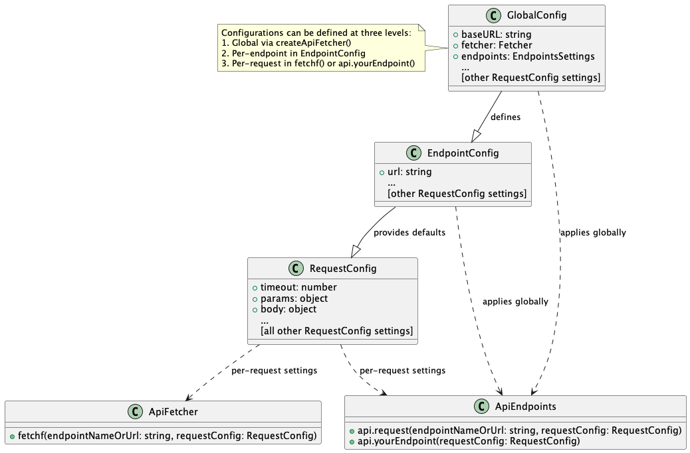

<div align="center">


<h4 align="center">Fast, lightweight (~4 KB gzipped) and reusable data fetching</h4>

<i>The last fetch wrapper you will ever need.</i>
<i>"fetchff" stands for "fetch fast & flexibly"</i>

[npm-url]: https://npmjs.org/package/fetchff
[npm-image]: https://img.shields.io/npm/v/fetchff.svg

[![NPM version][npm-image]][npm-url] [](https://github.com/MattCCC/fetchff) [](https://github.com/MattCCC/fetchff) [](http://npm-stat.com/charts.html?package=fetchff) [](https://bundlephobia.com/result?p=fetchff) [](https://security.snyk.io/package/npm/fetchff)

</div>

## Why?

This is a high level library to extend the functionality of native fetch() with everything necessary and no overhead, so to wrap and reuse common patterns and functionalities in a simple and declarative manner. It is designed to be used in high-throughput, high-performance applications.

Also, managing multitude of API connections in large applications can be complex, time-consuming and hard to scale. `fetchff` simplifies the process by offering a simple, declarative approach to API handling using Repository Pattern. It reduces the need for extensive setup, middlewares, retries, custom caching, and heavy plugins, and lets developers focus on data handling and application logic.

<details>
  <summary><span style="cursor:pointer">Click to expand</span></summary>
  <br>

**Some of challenges with Native Fetch that `fetchff` solves:**

- **Error Status Handling:** Fetch does not throw errors for HTTP error statuses, making it difficult to distinguish between successful and failed requests based on status codes alone.
- **Error Visibility:** Error responses with status codes like 404 or 500 are not automatically propagated as exceptions, which can lead to inconsistent error handling.
- **No Built-in Retry Mechanism:** Native `fetch()` lacks built-in support for retrying requests. Developers need to implement custom retry logic to handle transient errors or intermittent failures, which can be cumbersome and error-prone.
- **Network Errors Handling:** Native `fetch()` only rejects the Promise for network errors or failure to reach the server. Issues such as timeout errors or server unavailability do not trigger rejection by default, which can complicate error management.
- **Limited Error Information:** The error information provided by native `fetch()` is minimal, often leaving out details such as the request headers, status codes, or response bodies. This can make debugging more difficult, as there's limited visibility into what went wrong.
- **Lack of Interceptors:** Native `fetch()` does not provide a built-in mechanism for intercepting requests or responses. Developers need to manually manage request and response processing, which can lead to repetitive code and less maintainable solutions.
- **No Built-in Caching:** Native `fetch()` does not natively support caching of requests and responses. Implementing caching strategies requires additional code and management, potentially leading to inconsistencies and performance issues.

To address these challenges, the `fetchf()` provides several enhancements:

1. **Consistent Error Handling:**
   - In JavaScript, the native `fetch()` function does not reject the Promise for HTTP error statuses such as 404 (Not Found) or 500 (Internal Server Error). Instead, `fetch()` resolves the Promise with a `Response` object, where the `ok` property indicates the success of the request. If the request encounters a network error or fails due to other issues (e.g., server downtime), `fetch()` will reject the Promise.
   - The `fetchff` plugin aligns error handling with common practices and makes it easier to manage errors consistently by rejecting erroneous status codes.

2. **Enhanced Retry Mechanism:**
   - **Retry Configuration:** You can configure the number of retries, delay between retries, and exponential backoff for failed requests. This helps to handle transient errors effectively.
   - **Custom Retry Logic:** The `shouldRetry` asynchronous function allows for custom retry logic based on the error from `response.error` and attempt count, providing flexibility to handle different types of failures.
   - **Retry Conditions:** Errors are only retried based on configurable retry conditions, such as specific HTTP status codes or error types.

3. **Improved Error Visibility:**
   - **Error Wrapping:** The `createApiFetcher()` and `fetchf()` wrap errors in a custom `ResponseError` class, which provides detailed information about the request and response. This makes debugging easier and improves visibility into what went wrong.

4. **Extended settings:**
   - Check Settings table for more information about all settings.
   </details>

## ✔️ Benefits

✅ **Lightweight:** Minimal code footprint of ~4KB gzipped for managing extensive APIs.

✅ **High-Performance**: Optimized for speed and efficiency, ensuring fast and reliable API interactions.

✅ **Secure:** Secure by default rather than "permissive by default", with built-in sanitization mechanisms.

✅ **Immutable:** Every request has its own instance.

✅ **Isomorphic:** Compatible with Node.js, Deno and modern browsers.

✅ **Type Safe:** Strongly typed and written in TypeScript.

✅ **Scalable:** Easily scales from a few calls to complex API networks with thousands of APIs.

✅ **Tested:** Battle tested in large projects, fully covered by unit tests.

✅ **Customizable:** Fully compatible with a wide range configuration options, allowing for flexible and detailed request customization.

✅ **Responsible Defaults:** All settings are opt-in.

✅ **Framework Independent**: Pure JavaScript solution, compatible with any framework or library, both client and server side.

✅ **Browser and Node.js 18+ Compatible:** Works flawlessly in both modern browsers and Node.js environments.

✅ **Maintained:** Since 2021 publicly through Github.

## ✔️ Features

- **Smart Retry Mechanism**: Features exponential backoff for intelligent error handling and retry mechanisms.
- **Request Deduplication**: Set the time during which requests are deduplicated (treated as same request).
- **Cache Management**: Dynamically manage cache with configurable expiration, custom keys, and selective invalidation.
- **Dynamic URLs Support**: Easily manage routes with dynamic parameters, such as `/user/:userId`.
- **Error Handling**: Flexible error management at both global and individual request levels.
- **Request Cancellation**: Utilizes `AbortController` to cancel previous requests automatically.
- **Timeouts**: Set timeouts globally or per request to prevent hanging operations.
- **Fetching Strategies**: Handle failed requests with various strategies - promise rejection, silent hang, soft fail, or default response.
- **Requests Chaining**: Easily chain multiple requests using promises for complex API interactions.
- **Native `fetch()` Support**: Utilizes the built-in `fetch()` API, providing a modern and native solution for making HTTP requests.
- **Custom Interceptors**: Includes `onRequest`, `onResponse`, and `onError` interceptors for flexible request and response handling.

## ✔️ Install

[](https://npmjs.org/package/fetchff)

Using NPM:

```bash
npm install fetchff
```

Using Pnpm:

```bash
pnpm install fetchff
```

Using Yarn:

```bash
yarn add fetchff
```

## ✔️ API

### Standalone usage

#### `fetchf()`

It is a functional wrapper for `fetch()`. It seamlessly enhances it with additional settings like the retry mechanism and error handling improvements. The `fetchf()` can be used directly as a function, simplifying the usage and making it easier to integrate with functional programming styles. The `fetchf()` makes requests independently of `createApiFetcher()` settings.

#### Example

```typescript
import { fetchf } from 'fetchff';

const { data, error } = await fetchf('/api/user-details', {
  timeout: 5000,
  cancellable: true,
  retry: { retries: 3, delay: 2000 },
  // Specify some other settings here... The fetch() settings work as well...
});
```

### Multiple API Endpoints

#### `createApiFetcher()`

<details>
  <summary><span style="cursor:pointer">Click to expand</span></summary>
  <br>

It is a powerful factory function for creating API fetchers with advanced features. It provides a convenient way to configure and manage multiple API endpoints using a declarative approach. This function offers integration with retry mechanisms, error handling improvements, and all the other settings. Unlike traditional methods, `createApiFetcher()` allows you to set up and use API endpoints efficiently with minimal boilerplate code.

#### Example

```typescript
import { createApiFetcher } from 'fetchff';

// Create some endpoints declaratively
const api = createApiFetcher({
  baseURL: 'https://example.com/api',
  endpoints: {
    getUser: {
      url: '/user-details/:id/',
      method: 'GET',
      // Each endpoint accepts all settings declaratively
      retry: { retries: 3, delay: 2000 },
      timeout: 5000,
      cancellable: true,
    },
    // Define more endpoints as needed
  },
  // You can set all settings globally
  strategy: 'softFail', // no try/catch required in case of errors
});

// Make a GET request to http://example.com/api/user-details/2/?rating[]=1&rating[]=2
const { data, error } = await api.getUser({
  params: { rating: [1, 2] }, //  Passed arrays, objects etc. will be parsed automatically
  urlPathParams: { id: 2 }, // Replace :id with 2 in the URL
});
```

#### Multiple API Specific Settings

All the Request Settings can be directly used in the function as global settings for all endpoints. They can be also used within the `endpoints` property (on per-endpoint basis). The exposed `endpoints` property is as follows:

- **`endpoints`**:
  Type: `EndpointsConfig<EndpointsMethods>`
  List of your endpoints. Each endpoint is an object that accepts all the Request Settings (see the Basic Settings below). The endpoints are required to be specified.

#### How It Works

The `createApiFetcher()` automatically creates and returns API methods based on the `endpoints` object provided. It also exposes some extra methods and properties that are useful to handle global config, dynamically add and remove endpoints etc.

#### `api.yourEndpoint(requestConfig)`

Where `yourEndpoint` is the name of your endpoint, the key from `endpoints` object passed to the `createApiFetcher()`.

**`requestConfig`** (optional) `object` - To have more granular control over specific endpoints you can pass Request Config for particular endpoint. Check <b>Basic Settings</b> below for more information.

Returns: <b>Response Object</b> (see below).

#### `api.request(endpointNameOrUrl, requestConfig)`

The `api.request()` helper function is a versatile method provided for making API requests with customizable configurations. It allows you to perform HTTP requests to any endpoint defined in your API setup and provides a straightforward way to handle queries, path parameters, and request configurations dynamically.

##### Example

```typescript
import { createApiFetcher } from 'fetchff';

const api = createApiFetcher({
  apiUrl: 'https://example.com/api',
  endpoints: {
    updateUser: {
      url: '/update-user/:id',
      method: 'POST',
    },
    // Define more endpoints as needed
  },
});

// Using api.request to make a POST request
const { data, error } = await api.request('updateUser', {
  body: {
    name: 'John Doe', // Data Payload
  },
  urlPathParams: {
    id: '123', // URL Path Param :id will be replaced with 123
  },
});

// Using api.request to make a GET request to an external API
const { data, error } = await api.request('https://example.com/api/user', {
  params: {
    name: 'John Smith', // Query Params
  },
});
```

#### `api.config`

You can access `api.config` property directly to modify global headers and other settings on the fly. This is a property, not a function.

#### `api.endpoints`

You can access `api.endpoints` property directly to modify the endpoints list. This can be useful if you want to append or remove global endpoints. This is a property, not a function.

#### `api.getInstance()`

If you initialize API handler with your custom `fetcher`, then this function will return the instance created using `fetcher.create()` function. Your fetcher can include anything. It will be triggering `fetcher.request()` instead of native fetch() that is available by default. It gives you ultimate flexibility on how you want your requests to be made.

</details>

## 🛠️ Plugin API Architecture

<details>
  <summary><span style="cursor:pointer">Click to expand</span></summary>
  <br>



</details>

## ⚙️ Basic Settings

<details>
  <summary><span style="cursor:pointer">Click to expand</span></summary>
  <br>

You can pass the settings:

- globally for all requests when calling `createApiFetcher()`
- per-endpoint basis defined under `endpoints` in global config when calling `createApiFetcher()`
- per-request basis when calling `fetchf()` (second argument of the function) or in the `api.yourEndpoint()` (third argument)

You can also use all native [`fetch()` settings](https://developer.mozilla.org/en-US/docs/Web/API/fetch#parameters).

|                            | Type                                                                                                   | Default | Description                                                                                                                                                                                                                                                                                                                                                                                                                                                                                                                                                                                                                                                 |
| -------------------------- | ------------------------------------------------------------------------------------------------------ | ------- | ----------------------------------------------------------------------------------------------------------------------------------------------------------------------------------------------------------------------------------------------------------------------------------------------------------------------------------------------------------------------------------------------------------------------------------------------------------------------------------------------------------------------------------------------------------------------------------------------------------------------------------------------------------- |
| baseURL<br>(alias: apiUrl) | `string`                                                                                               |         | Your API base url.                                                                                                                                                                                                                                                                                                                                                                                                                                                                                                                                                                                                                                          |
| url                        | `string`                                                                                               |         | URL path e.g. /user-details/get                                                                                                                                                                                                                                                                                                                                                                                                                                                                                                                                                                                                                             |
| method                     | `string`                                                                                               | `GET`   | Default request method e.g. GET, POST, DELETE, PUT etc. All methods are supported.                                                                                                                                                                                                                                                                                                                                                                                                                                                                                                                                                                          |
| params                     | `object`<br>`URLSearchParams`<br>`NameValuePair[]`                                                     | `{}`    | Query Parameters - a key-value pairs added to the URL to send extra information with a request. If you pass an object, it will be automatically converted. It works with nested objects, arrays and custom data structures similarly to what `jQuery` used to do in the past. If you use `createApiFetcher()` then it is the first argument of your `api.yourEndpoint()` function. You can still pass configuration in 3rd argument if want to.<br><br>You can pass key-value pairs where the values can be strings, numbers, or arrays. For example, if you pass `{ foo: [1, 2] }`, it will be automatically serialized into `foo[]=1&foo[]=2` in the URL. |
| body<br>(alias: data)      | `object`<br>`string`<br>`FormData`<br>`URLSearchParams`<br>`Blob`<br>`ArrayBuffer`<br>`ReadableStream` | `{}`    | The body is the data sent with the request, such as JSON, text, or form data, included in the request payload for POST, PUT, or PATCH requests.                                                                                                                                                                                                                                                                                                                                                                                                                                                                                                             |
| urlPathParams              | `object`                                                                                               | `{}`    | It lets you dynamically replace segments of your URL with specific values in a clear and declarative manner. This feature is especially handy for constructing URLs with variable components or identifiers.<br><br>For example, suppose you need to update user details and have a URL template like `/user-details/update/:userId`. With `urlPathParams`, you can replace `:userId` with a real user ID, such as `123`, resulting in the URL `/user-details/update/123`.                                                                                                                                                                                  |
| flattenResponse            | `boolean`                                                                                              | `false` | When set to `true`, this option flattens the nested response data. This means you can access the data directly without having to use `response.data.data`. It works only if the response structure includes a single `data` property.                                                                                                                                                                                                                                                                                                                                                                                                                       |
| defaultResponse            | `any`                                                                                                  | `null`  | Default response when there is no data or when endpoint fails depending on the chosen `strategy`                                                                                                                                                                                                                                                                                                                                                                                                                                                                                                                                                            |
| withCredentials            | `boolean`                                                                                              | `false` | Indicates whether credentials (such as cookies) should be included with the request. This equals to `credentials: "include"` in native `fetch()`. In Node.js, cookies are not managed automatically. Use a fetch polyfill or library that supports cookies if needed.                                                                                                                                                                                                                                                                                                                                                                                       |
| timeout                    | `number`                                                                                               | `30000` | You can set a request timeout in milliseconds. By default 30 seconds (30000 ms). The timeout option applies to each individual request attempt including retries and polling. `0` means that the timeout is disabled.                                                                                                                                                                                                                                                                                                                                                                                                                                       |
| revalidateOnFocus          | `boolean`                                                                                              | `false` | When set to `true`, automatically revalidates (refetches) data when the browser window regains focus. **Note: This bypasses the cache and always makes a fresh network request** to ensure users see the most up-to-date data when they return to your application from another tab or window. Particularly useful for applications that display real-time or frequently changing data, but should be used judiciously to avoid unnecessary network traffic.                                                                                                                                                                                                |
| logger                     | `Logger`                                                                                               | `null`  | You can additionally specify logger object with your custom logger to automatically log the errors to the console. It should contain at least `error` and `warn` functions.                                                                                                                                                                                                                                                                                                                                                                                                                                                                                 |
| fetcher                    | `CustomFetcher`                                                                                        |         | A custom fetcher function. By default, the native `fetch()` is used.                                                                                                                                                                                                                                                                                                                                                                                                                                                                                                                                                                                        |

</details>

## 🏷️ Headers

<details>
  <summary><span style="cursor:pointer">Click to expand</span></summary>
  <br>

`fetchff` provides robust support for handling HTTP headers in your requests. You can configure and manipulate headers at both global and per-request levels. Here’s a detailed overview of how to work with headers using `fetchff`.

**Note:** Header keys are case-sensitive when specified in request objects. Ensure that the keys are provided in the correct case to avoid issues with header handling.

### Setting Headers Globally

You can set default headers that will be included in all requests made with a specific `createApiFetcher` instance. This is useful for setting common headers like authentication tokens or content types.

#### Example: Setting Headers Globally

```typescript
import { createApiFetcher } from 'fetchff';

const api = createApiFetcher({
  baseURL: 'https://api.example.com/',
  headers: {
    'Content-Type': 'application/json',
    Authorization: 'Bearer YOUR_TOKEN',
  },
  // other configurations
});
```

### Setting Per-Request Headers

In addition to global default headers, you can also specify headers on a per-request basis. This allows you to override global headers or set specific headers for individual requests.

#### Example: Setting Per-Request Headers

```typescript
import { fetchf } from 'fetchff';

// Example of making a GET request with custom headers
const { data } = await fetchf('https://api.example.com/endpoint', {
  headers: {
    Authorization: 'Bearer YOUR_ACCESS_TOKEN',
    'Custom-Header': 'CustomValue',
  },
});
```

### Default Headers

The `fetchff` plugin automatically injects a set of default headers into every request. These default headers help ensure that requests are consistent and include necessary information for the server to process them correctly.

- **`Content-Type`**: `application/json;charset=utf-8`
  Specifies that the request body contains JSON data and sets the character encoding to UTF-8.

- **`Accept`**: `application/json, text/plain, */*`
  Indicates the media types that the client is willing to receive from the server. This includes JSON, plain text, and any other types.

- **`Accept-Encoding`**: `gzip, deflate, br`
  Specifies the content encoding that the client can understand, including gzip, deflate, and Brotli compression.

> ⚠️ **Accept-Encoding in Node.js:**  
> In Node.js, decompression is handled by the fetch implementation, and users should ensure their environment supports the encodings.

</details>

## 🌀 Interceptors

<details>
  <summary><span style="cursor:pointer">Click to expand</span></summary>
  <br>
  Interceptor functions can be provided to customize the behavior of requests and responses. These functions are invoked at different stages of the request lifecycle and allow for flexible handling of requests, responses, and errors.

### Example

```typescript
const { data } = await fetchf('https://api.example.com/', {
  onRequest(config) {
    // Add a custom header before sending the request
    config.headers['Authorization'] = 'Bearer your-token';
  },
  onResponse(response) {
    // Log the response status
    console.log(`Response Status: ${response.status}`);
  },
  onError(error, config) {
    // Handle errors and log the request config
    console.error('Request failed:', error);
    console.error('Request config:', config);
  },
});
```

### Configuration

The following options are available for configuring interceptors in the `RequestHandler`:

- **`onRequest`**:  
  Type: `RequestInterceptor | RequestInterceptor[]`  
  A function or an array of functions that are invoked before sending a request. Each function receives the request configuration object as its argument, allowing you to modify request parameters, headers, or other settings.  
  _Default:_ `(config) => config` (no modification).

- **`onResponse`**:  
  Type: `ResponseInterceptor | ResponseInterceptor[]`  
  A function or an array of functions that are invoked when a response is received. Each function receives the full response object, enabling you to process the response, handle status codes, or parse data as needed.  
  _Default:_ `(response) => response` (no modification).

- **`onError`**:  
  Type: `ErrorInterceptor | ErrorInterceptor[]`  
  A function or an array of functions that handle errors when a request fails. Each function receives the error and request configuration as arguments, allowing you to implement custom error handling logic or logging.  
  _Default:_ `(error) => error` (no modification).

### How It Works

1. **Request Interception**:  
   Before a request is sent, the `onRequest` interceptors are invoked. These interceptors can modify the request configuration, such as adding headers or changing request parameters.

2. **Response Interception**:  
   Once a response is received, the `onResponse` interceptors are called. These interceptors allow you to handle the response data, process status codes, or transform the response before it is returned to the caller.

3. **Error Interception**:  
   If a request fails and an error occurs, the `onError` interceptors are triggered. These interceptors provide a way to handle errors, such as logging or retrying requests, based on the error and the request configuration.

4. **Custom Handling**:  
   Each interceptor function provides a flexible way to customize request and response behavior. You can use these functions to integrate with other systems, handle specific cases, or modify requests and responses as needed.

</details>

## 🗄️ Cache Management

<details>
  <summary><span style="cursor:pointer">Click to expand</span></summary>
  <br>
  The caching mechanism in <b>fetchf()</b> and <b>createApiFetcher()</b> enhances performance by reducing redundant network requests and reusing previously fetched data when appropriate. This system ensures that cached responses are managed efficiently and only used when considered "fresh". Below is a breakdown of the key parameters that control caching behavior and their default values.
<br><br>

> ⚠️ **When using in Node.js:**  
> Cache and deduplication are in-memory and per-process. For distributed or serverless environments, consider external caching if persistence is needed.

### Example

```typescript
const { data } = await fetchf('https://api.example.com/', {
  cacheTime: 300, // Cache is valid for 5 minutes, set -1 for indefinite cache. By default no cache.
  cacheKey: (config) => `${config.url}-${config.method}`, // Custom cache key based on URL and method, default automatically generated
  cacheBuster: (config) => config.method === 'POST', // Bust cache for POST requests, by default no busting.
  skipCache: (response, config) => response.status !== 200, // Skip caching on non-200 responses, by default no skipping
  cacheErrors: false, // Cache error responses as well as successful ones, default false
});
```

### Configuration

The caching system can be fine-tuned using the following options when configuring the:

- **`cacheTime`**:  
  Type: `number`  
  Specifies the duration, in seconds, for which a cache entry is considered "fresh." Once this time has passed, the entry is considered stale and may be refreshed with a new request. Set to -1 for indefinite cache.
  _Default:_ `undefined` (no caching).

- **`cacheKey`**:  
  Type: `CacheKeyFunction | string`  
  A string or function used to generate a custom cache key for the request cache, deduplication etc. If not provided, a default key is created by hashing various parts of the request, including `Method`, `URL`, query parameters, and headers etc. Providing string can help to greatly improve the performance of the requests, avoid unnecessary request flooding etc.

  You can provide either:
  - A **string**: Used directly as the cache key for all requests using matching string.
  - A **function**: Receives the full request config as an argument and should return a unique string key. This allows you to include any relevant part of the request (such as URL, method, params, body, or custom logic) in the cache key.

  **Example:**

  ```typescript
  cacheKey: (config) =>
    `${config.method}:${config.url}:${JSON.stringify(config.params)}`;
  ```

  This flexibility ensures you can control cache granularity—whether you want to cache per endpoint, per user, or based on any other criteria.

  _Default:_ Auto-generated based on request properties (see below).

- **`cacheBuster`**:  
  Type: `CacheBusterFunction`  
  A function that allows you to invalidate or refresh the cache under certain conditions, such as specific request methods or response properties. This is useful for ensuring that certain requests (e.g., `POST`) bypass the cache.  
  _Default:_ `(config) => false` (no cache busting).

- **`skipCache`**:  
  Type: `CacheSkipFunction`  
  A function that determines whether caching should be skipped based on the response. This allows for fine-grained control over whether certain responses are cached or not, such as skipping non-`200` responses.  
  _Default:_ `(response, config) => false` (no skipping).

- **`cacheErrors`**:  
  Type: `boolean`  
  Determines whether error responses (such as HTTP 4xx or 5xx) should also be cached. If set to `true`, both successful and error responses are stored in the cache. If `false`, only successful responses are cached.  
  _Default:_ `false`.

### How It Works

1. **Request and Cache Check**:  
   When a request is made, the cache is first checked for an existing entry. If a valid cache entry is found and is still "fresh" (based on `cacheTime`), the cached response is returned immediately. Note that when the native `fetch()` setting called `cache` is set to `reload` the request will automatically skip the internal cache.

2. **Cache Key**:  
   A cache key uniquely identifies each request. By default, the key is generated based on the URL and other relevant request options. Custom keys can be provided using the `cacheKey` function.

3. **Cache Busting**:  
   If the `cacheBuster` function is defined, it determines whether to invalidate and refresh the cache for specific requests. This is useful for ensuring that certain requests, such as `POST` requests, always fetch new data.

4. **Skipping Cache**:  
   The `skipCache` function provides flexibility in deciding whether to store a response in the cache. For example, you might skip caching responses that have a `4xx` or `5xx` status code.

5. **Final Outcome**:  
   If no valid cache entry is found, or the cache is skipped or busted, the request proceeds to the network, and the response is cached based on the provided configuration.

### Auto-Generated Cache Key Properties

By default, `fetchff` generates a cache key automatically using a combination of the following request properties:

| Property          | Description                                                                               | Default Value    |
| ----------------- | ----------------------------------------------------------------------------------------- | ---------------- |
| `method`          | The HTTP method used for the request (e.g., GET, POST).                                   | `'GET'`          |
| `url`             | The full request URL, including the base URL and endpoint path.                           | `''`             |
| `headers`         | Request headers, included as a stringified object.                                        |                  |
| `body`            | The request payload (for POST, PUT, PATCH, etc.), stringified if it's an object or array. |                  |
| `mode`            | The mode for the request (e.g., 'cors', 'no-cors', 'same-origin').                        | `'cors'`         |
| `credentials`     | Indicates whether credentials (cookies) are included in the request.                      | `'same-origin'`  |
| `cache`           | The cache mode for the request (e.g., 'default', 'reload').                               | `'default'`      |
| `redirect`        | The redirect mode for the request (e.g., 'follow', 'manual', 'error').                    | `'follow'`       |
| `referrer`        | The referrer of the request.                                                              | `'about:client'` |
| `integrity`       | Subresource integrity value for the request.                                              | `''`             |
| `params`          | Query parameters serialized into the URL (objects, arrays, etc. are stringified).         |                  |
| `urlPathParams`   | Dynamic URL path parameters (e.g., `/user/:id`), stringified and encoded.                 |                  |
| `withCredentials` | Whether credentials (cookies) are included in the request.                                |                  |

These properties are combined and hashed to create a unique cache key for each request. This ensures that requests with different parameters, bodies, or headers are cached separately.

</details>

## 🔁 Deduplication & In-Flight Requests

<details>
  <summary><span style="cursor:pointer">Click to expand</span></summary>
  <br>

`fetchff` automatically deduplicates identical requests that are made within a configurable time window, ensuring that only one network request is sent for the same endpoint and parameters. This is especially useful for scenarios where multiple components or users might trigger the same request simultaneously (e.g., rapid user input, concurrent UI updates).

> ⚠️ **When using in Node.js:**  
> Request queueing and deduplication are per-process. In multi-process or serverless environments, requests are not deduplicated across instances.

### How Deduplication Works

- When a request is made, `fetchff` checks if an identical request (same URL, method, params, and body) is already in progress or was recently completed within the `dedupeTime` window.
- If such a request exists, the new request will "join" the in-flight request and receive the same response when it completes, rather than triggering a new network call.
- This mechanism reduces unnecessary network traffic and ensures consistent data across your application.

### Configuration

- **`dedupeTime`**:
  - Type: `number`
  - Default: `0` (milliseconds)
  - Specifies the time window during which identical requests are deduplicated. If set to `0`, deduplication is disabled.

### Example

```typescript
import { fetchf } from 'fetchff';

// Multiple rapid calls to the same endpoint will be deduplicated
fetchf('/api/search', { params: { q: 'test' }, dedupeTime: 2000 });
fetchf('/api/search', { params: { q: 'test' }, dedupeTime: 2000 });
// Only one network request will be sent within the 2-second window
```

### Benefits

- Prevents duplicate network requests for the same resource.
- Reduces backend load and improves frontend performance.
- Ensures that all consumers receive the same response for identical requests made in quick succession.

This deduplication logic is applied both to standalone `fetchf()` calls and to endpoints created with `createApiFetcher()`.

</details>

## ✋ Request Cancellation

<details>
  <summary><span style="cursor:pointer">Click to expand</span></summary>
  <br>
<b>fetchff</b> simplifies making API requests by allowing customizable features such as request cancellation, retries, and response flattening. When a new request is made to the same API endpoint, the plugin automatically cancels any previous requests that haven't completed, ensuring that only the most recent request is processed.
<br><br>
It also supports:

- Automatic retries for failed requests with configurable delay and exponential backoff.
- Optional flattening of response data for easier access, removing nested `data` fields.

You can choose to reject cancelled requests or return a default response instead through the `defaultResponse` setting.

### Example

```javascript
import { fetchf } from 'fetchff';

// Function to send the request
const sendRequest = () => {
  // In this example, the previous requests are automatically cancelled
  // You can also control "dedupeTime" setting in order to fire the requests more or less frequently
  fetchf('https://example.com/api/messages/update', {
    method: 'POST',
    cancellable: true,
    rejectCancelled: true,
  });
};

// Attach keydown event listener to the input element with id "message"
document.getElementById('message')?.addEventListener('keydown', sendRequest);
```

### Configuration

- **`cancellable`**:
  Type: `boolean`
  Default: `false`
  If set to `true`, any ongoing previous requests to the same API endpoint will be automatically cancelled when a subsequent request is made before the first one completes. This is useful in scenarios where repeated requests are made to the same endpoint (e.g., search inputs) and only the latest response is needed, avoiding unnecessary requests to the backend.

- **`rejectCancelled`**:
  Type: `boolean`
  Default: `false`
  Works in conjunction with the `cancellable` option. If set to `true`, the promise of a cancelled request will be rejected. By default (`false`), when a request is cancelled, instead of rejecting the promise, a `defaultResponse` will be returned, allowing graceful handling of cancellation without errors.

</details>

## 📶 Polling Configuration

<details>
  <summary><span style="cursor:pointer">Click to expand</span></summary>
  <br>
  Polling can be configured to repeatedly make requests at defined intervals until certain conditions are met. This allows for continuously checking the status of a resource or performing background updates.

### Example

```typescript
const { data } = await fetchf('https://api.example.com/', {
  pollingInterval: 5000, // Poll every 5 seconds (useful for regular polling at intervals)
  pollingDelay: 1000, // Wait 1 second before each polling attempt begins
  maxPollingAttempts: 10, // Stop polling after 10 attempts
  shouldStopPolling(response, attempt) {
    if (response && response.status === 200) {
      return true; // Stop polling if the response status is 200 (OK)
    }
    if (attempt >= 10) {
      return true; // Stop polling after 10 attempts
    }
    return false; // Continue polling otherwise
  },
});
```

### Configuration

The following options are available for configuring polling in the `RequestHandler`:

- **`pollingInterval`**:  
  Type: `number`  
  Interval in milliseconds between polling attempts. If set to `0`, polling is disabled. This allows you to control the frequency of requests when polling is enabled. It is useful for regular, periodic polling.
  _Default:_ `0` (polling disabled).

- **`pollingDelay`**:  
   Type: `number`  
   The time (in milliseconds) to wait before each polling attempt begins. It is useful if you want to throttle or stagger requests, or wait a bit before each poll. It basically adds a delay before each poll is started (including the first one).
  _Default:_ `0` (no delay).

- **`maxPollingAttempts`**:  
  Type: `number`  
  Maximum number of polling attempts before stopping. Set to `< 1` for unlimited attempts.  
  _Default:_ `0` (unlimited).

- **`shouldStopPolling`**:  
  Type: `(response: any, attempt: number) => boolean`  
  A function to determine if polling should stop based on the response, error, or the current polling attempt number (attempt starts with `1`). Return `true` to stop polling, and `false` to continue polling. This allows for custom logic to decide when to stop polling based on the conditions of the response or error.  
  _Default:_ `(response, attempt) => false` (polling continues indefinitely unless manually stopped).

### How It Works

1. **Polling Interval**:  
   When `pollingInterval` is set to a non-zero value, polling begins after the initial request. The request is repeated at intervals defined by the `pollingInterval` setting.

2. **Polling Delay**:  
   The `pollingDelay` setting introduces a delay before each polling attempt, allowing for finer control over the timing of requests.

3. **Maximum Polling Attempts**:  
   The `maxPollingAttempts` setting limits the number of polling attempts. If the maximum number of attempts is reached, polling stops automatically.

4. **Stopping Polling**:  
   The `shouldStopPolling` function is invoked after each polling attempt. If it returns `true`, polling will stop. Otherwise, polling will continue until the condition to stop is met, or polling is manually stopped.

5. **Custom Logic**:  
   The `shouldStopPolling` function provides flexibility to implement custom logic based on the response, error, or the number of attempts. This makes it easy to stop polling when the desired outcome is reached or after a maximum number of attempts.

</details>

## 🔄 Retry Mechanism

<details>
  <summary><span style="cursor:pointer">Click to expand</span></summary>
  <br>
The retry mechanism can be used to handle transient errors and improve the reliability of network requests. This mechanism automatically retries requests when certain conditions are met, providing robustness in the face of temporary failures. Below is an overview of how the retry mechanism works and how it can be configured.

### Example

```typescript
const { data } = await fetchf('https://api.example.com/', {
  retry: {
    retries: 5,
    delay: 100,
    maxDelay: 5000,
    resetTimeout: true, // Resets the timeout for each retry attempt
    backoff: 1.5,
    retryOn: [500, 503],
    // Retry on specific errors or based on custom logic
    shouldRetry(response, attempt) {
      // Retry if the status text is Not Found (404)
      if (response.error && response.error.statusText === 'Not Found') {
        return true;
      }

      // Use `response.data` to access any data from fetch() response
      const data = response.data;

      // Let's say your backend returns bookId as "none". You can force retry by returning "true".
      if (data?.bookId === 'none') {
        return true;
      }

      return attempt < 3; // Retry up to 3 times.
    },
  },
});
```

In this example, the request will retry only on HTTP status codes 500 and 503, as specified in the `retryOn` array. The `resetTimeout` option ensures that the timeout is restarted for each retry attempt. The custom `shouldRetry` function adds further logic: if the server response contains `{"bookId": "none"}`, a retry is forced. Otherwise, the request will retry only if the current attempt number is less than 3. Although the `retries` option is set to 5, the `shouldRetry` function limits the maximum attempts to 3 (the initial request plus 2 retries).

Additionally, you can handle "Not Found" (404) responses or other specific status codes in your retry logic. For example, you might want to retry when the status text is "Not Found":

```typescript
shouldRetry(response, attempt) {
  // Retry if the status text is Not Found (404)
  if (response.error && response.error.statusText === 'Not Found') {
    return true;
  }
  // ...other logic
}
```

This allows you to customize retry behavior for cases where a resource might become available after a short delay, or when you want to handle transient 404 errors gracefully.

The whole Error object is under `response.error` generally.

### Configuration

The retry mechanism is configured via the `retry` option when instantiating the `RequestHandler`. You can customize the following parameters:

- **`retries`**:  
  Type: `number`  
  Number of retry attempts to make after an initial failure.  
  _Default:_ `0` (no retries).

- **`delay`**:  
  Type: `number`  
  Initial delay (in milliseconds) before the first retry attempt. Subsequent retries use an exponentially increasing delay based on the `backoff` parameter.  
  _Default:_ `1000` (1 second).

- **`maxDelay`**:  
  Type: `number`  
  Maximum delay (in milliseconds) between retry attempts. The delay will not exceed this value, even if the exponential backoff would suggest a longer delay.  
  _Default:_ `30000` (30 seconds).

- **`backoff`**:  
  Type: `number`  
  Factor by which the delay is multiplied after each retry. For example, a `backoff` factor of `1.5` means each retry delay is 1.5 times the previous delay. It means that after the first failure, wait for x seconds. After the second failure, wait for x _ 1.5 seconds. After the third failure, wait for x _ 1.5^2 seconds, and so on.
  _Default:_ `1.5`.

- **`resetTimeout`**:  
  Type: `boolean`  
  If set to `true`, the timeout for the request is reset for each retry attempt. This ensures that the timeout applies to each individual retry rather than the entire request lifecycle.  
  _Default:_ `true`.

- **`retryOn`**:  
  Type: `number[]`  
  Array of HTTP status codes that should trigger a retry. By default, retries are triggered for the following status codes:
  - `408` - Request Timeout
  - `409` - Conflict
  - `425` - Too Early
  - `429` - Too Many Requests
  - `500` - Internal Server Error
  - `502` - Bad Gateway
  - `503` - Service Unavailable
  - `504` - Gateway Timeout

- **`shouldRetry(response, currentAttempt)`**:  
  Type: `RetryFunction`  
  Function that determines whether a retry should be attempted <b>based on the error</b> from <b>response</b> object (accessed by: <b>response.error</b>), and the current attempt number. This function receives the error object and the attempt number as arguments.  
  _Default:_ Retry up to the number of specified attempts.

### How It Works

1. **Initial Request**: When a request fails, the retry mechanism captures the failure and checks if it should retry based on the `retryOn` configuration and the result of the `shouldRetry` function.

2. **Retry Attempts**: If a retry is warranted:
   - The request is retried up to the specified number of attempts (`retries`).
   - Each retry waits for a delay before making the next attempt. The delay starts at the initial `delay` value and increases exponentially based on the `backoff` factor, but will not exceed the `maxDelay`.
   - If `resetTimeout` is enabled, the timeout is reset for each retry attempt.

3. **Logging**: During retries, the mechanism logs warnings indicating the retry attempts and the delay before the next attempt, which helps in debugging and understanding the retry behavior.

4. **Final Outcome**: If all retry attempts fail, the request will throw an error, and the final failure is processed according to the configured error handling logic.

### 429 Retry-After Handling

When a request receives a **429 Too Many Requests** response, `fetchff` will automatically check for the `Retry-After` header and use its value to determine the delay before the next retry attempt. This works for both seconds and HTTP-date formats, and falls back to your configured delay if the header is missing or invalid.

**How it works:**

- If the server responds with 429 and a `Retry-After` header, the delay for the next retry will be set to the value from that header (in ms).
- If the header is missing or invalid, the default retry delay is used.

**Example:**

```typescript
const { data } = await fetchf('https://api.example.com/', {
  retry: {
    retries: 2,
    delay: 1000, // fallback if Retry-After is missing
    retryOn: [429], // 429 is already checked by default so it is not necessary to add it
  },
});
```

If the server responds with:

```
HTTP/1.1 429 Too Many Requests
Retry-After: 5
```

The next retry will wait 5000ms before attempting again.

If the header is an HTTP-date, the delay will be calculated as the difference between the date and the current time.

</details>

## 🧩 Response Data Transformation

<details>
  <summary><span style="cursor:pointer">Click to expand</span></summary>
  <br>

The `fetchff` plugin automatically handles response data transformation for any instance of `Response` returned by the `fetch()` (or a custom `fetcher`) based on the `Content-Type` header, ensuring that data is parsed correctly according to its format.

### **How It Works**

- **JSON (`application/json`):** Parses the response as JSON.
- **Form Data (`multipart/form-data`):** Parses the response as `FormData`.
- **Binary Data (`application/octet-stream`):** Parses the response as a `Blob`.
- **URL-encoded Form Data (`application/x-www-form-urlencoded`):** Parses the response as `FormData`.
- **Text (`text/*`):** Parses the response as plain text.

If the `Content-Type` header is missing or not recognized, the plugin defaults to attempting JSON parsing. If that fails, it will try to parse the response as text.

This approach ensures that the `fetchff` plugin can handle a variety of response formats, providing a flexible and reliable method for processing data from API requests.

> ⚠️ **When using in Node.js:**  
> In Node.js, using FormData, Blob, or ReadableStream may require additional polyfills or will not work unless your fetch polyfill supports them.

### `onResponse` Interceptor

You can use the `onResponse` interceptor to customize how the response is handled before it reaches your application. This interceptor gives you access to the raw `Response` object, allowing you to transform the data or modify the response behavior based on your needs.

</details>

## 📄 Response Object

<details>
  <summary><span style="cursor:pointer">Click to expand</span></summary>
    <br>
  Every request returns a standardized response object from native <code>fetch()</code> extended by a few handful properties:

### Response Object Structure

```typescript
interface FetchResponse<
  ResponseData = any,
  QueryParams = any,
  PathParams = any,
  RequestBody = any,
> extends Response {
  data: ResponseData | null; // The parsed response data, or null/defaultResponse if unavailable
  error: ResponseError<
    ResponseData,
    QueryParams,
    PathParams,
    RequestBody
  > | null; // Error details if the request failed, otherwise null
  config: RequestConfig; // The configuration used for the request
  status: number; // HTTP status code
  statusText: string; // HTTP status text
  headers: HeadersObject; // Response headers as a key-value object
}
```

- **`data`**:  
  The actual data returned from the API, or `null`/`defaultResponse` if not available.

- **`error`**:  
  An object containing error details if the request failed, or `null` otherwise. Includes properties such as `name`, `message`, `status`, `statusText`, `request`, `config`, and the full `response`.

- **`config`**:  
  The complete configuration object used for the request, including URL, method, headers, and parameters.

- **`status`**:  
  The HTTP status code of the response (e.g., 200, 404, 500).

- **`statusText`**:  
  The HTTP status text (e.g., 'OK', 'Not Found', 'Internal Server Error').

- **`headers`**:  
  The response headers as a plain key-value object.

The whole response of the native `fetch()` is attached as well.

Error object in `error` looks as follows:

- **Type**: `ResponseError<ResponseData, QueryParams, PathParams, RequestBody> | null`

- An object with details about any error that occurred or `null` otherwise.
- **`name`**: The name of the error, that is `ResponseError`.
- **`message`**: A descriptive message about the error.
- **`status`**: The HTTP status code of the response (e.g., 404, 500).
- **`statusText`**: The HTTP status text of the response (e.g., 'Not Found', 'Internal Server Error').
- **`request`**: Details about the HTTP request that was sent (e.g., URL, method, headers).
- **`config`**: The configuration object used for the request, including URL, method, headers, and query parameters.
- **`response`**: The full response object received from the server, including all headers and body.

</details>

## 🔍 Error Handling

<details>
  <summary><span style="cursor:pointer">Click to expand</span></summary>
  <br>
  Error handling strategies define how to manage errors that occur during requests. You can configure the <b>strategy</b> option to specify what should happen when an error occurs. This affects whether promises are rejected, if errors are handled silently, or if default responses are provided. You can also combine it with <b>onError</b> interceptor for more tailored approach.

  <br>
  <br>

The native `fetch()` API function doesn't throw exceptions for HTTP errors like `404` or `500` — it only rejects the promise if there is a network-level error (e.g. the request fails due to a DNS error, no internet connection, or CORS issues). The `fetchf()` function brings consistency and lets you align the behavior depending on chosen strategy. By default, all errors are rejected.

### Configuration

#### `strategy`

**`reject`**: (default)
Promises are rejected, and global error handling is triggered. You must use `try/catch` blocks to handle errors.

```typescript
try {
  const { data } = await fetchf('https://api.example.com/', {
    strategy: 'reject', // It is default so it does not really needs to be specified
  });
} catch (error) {
  console.error(error.status, error.statusText, error.response, error.config);
}
```

**`softFail`**:  
 Returns a response object with additional property of `error` when an error occurs and does not throw any error. This approach helps you to handle error information directly within the response's `error` object without the need for `try/catch` blocks.

> ⚠️ **Always Check the error Property:**  
> When using the softFail or defaultResponse strategies, the promise will not throw on error.
> You must always check the error property in the response object to detect and handle errors.

```typescript
const { data, error } = await fetchf('https://api.example.com/', {
  strategy: 'softFail',
});

if (error) {
  console.error(error.status, error.statusText, error.response, error.config);
}
```

Check `Response Object` section below to see how `error` object is structured.

**`defaultResponse`**:  
 Returns a default response specified in case of an error. The promise will not be rejected. This can be used in conjunction with `flattenResponse` and `defaultResponse: {}` to provide sensible defaults.

> ⚠️ **Always Check the error Property:**  
> When using the softFail or defaultResponse strategies, the promise will not throw on error.
> You must always check the error property in the response object to detect and handle errors.

```typescript
const { data, error } = await fetchf('https://api.example.com/', {
  strategy: 'defaultResponse',
  defaultResponse: {},
});

if (error) {
  console.error('Request failed', data); // "data" will be equal to {} if there is an error
}
```

**`silent`**:  
 Hangs the promise silently on error, useful for fire-and-forget requests without the need for `try/catch`. In case of an error, the promise will never be resolved or rejected, and any code after will never be executed. This strategy is useful for dispatching requests within asynchronous wrapper functions that do not need to be awaited. It prevents excessive usage of `try/catch` or additional response data checks everywhere. It can be used in combination with `onError` to handle errors separately.

> ⚠️ **When using in Node.js:**  
> The 'silent' strategy will hang the promise forever. Use with caution, especially in backend/server environments.

```typescript
async function myLoadingProcess() {
  const { data } = await fetchf('https://api.example.com/', {
    strategy: 'silent',
  });

  // In case of an error nothing below will ever be executed.
  console.log('This console log will not appear.');
}

myLoadingProcess();
```

##### How It Works

1. **Reject Strategy**:  
   When using the `reject` strategy, if an error occurs, the promise is rejected, and global error handling logic is triggered. You must use `try/catch` to handle these errors.

2. **Soft Fail Strategy**:  
   With `softFail`, the response object includes additional properties that provide details about the error without rejecting the promise. This allows you to handle error information directly within the response.

3. **Default Response Strategy**:  
   The `defaultResponse` strategy returns a predefined default response when an error occurs. This approach prevents the promise from being rejected, allowing for default values to be used in place of error data.

4. **Silent Strategy**:  
   The `silent` strategy results in the promise hanging silently on error. The promise will not be resolved or rejected, and any subsequent code will not execute. This is useful for fire-and-forget requests and can be combined with `onError` for separate error handling.

5. **Custom Error Handling**:  
   Depending on the strategy chosen, you can tailor how errors are managed, either by handling them directly within response objects, using default responses, or managing them silently.

#### `onError`

The `onError` option can be configured to intercept errors:

```typescript
const { data } = await fetchf('https://api.example.com/', {
  strategy: 'softFail',
  onError(error) {
    // Intercept any error
    console.error('Request failed', error.status, error.statusText);
  },
});
```

#### Different Error and Success Responses

There might be scenarios when your successful response data structure differs from the one that is on error. In such circumstances you can use union type and assign it depending on if it's an error or not.

```typescript
interface SuccessResponseData {
  bookId: string;
  bookText: string;
}

interface ErrorResponseData {
  errorCode: number;
  errorText: string;
}

type ResponseData = SuccessResponseData | ErrorResponseData;

const { data, error } = await fetchf<ResponseData>('https://api.example.com/', {
  strategy: 'softFail',
});

// Check for error here as 'data' is available for both successful and erroneous responses
if (error) {
  const errorData = data as ErrorResponseData;

  console.log('Request failed', errorData.errorCode, errorData.errorText);
} else {
  const successData = data as SuccessResponseData;

  console.log('Request successful', successData.bookText);
}
```

</details>

## 📦 Typings

<details>
  <summary><span style="cursor:pointer">Click to expand</span></summary>
  <br>

The `fetchff` package provides comprehensive TypeScript typings to enhance development experience and ensure type safety. Below are details on the available, exportable types for both `createApiFetcher()` and `fetchf()`.

### Generic Typings

The `fetchff` package includes several generic types to handle various aspects of API requests and responses:

- **`QueryParams<ParamsType>`**: Represents query parameters for requests. Can be an object, `URLSearchParams`, an array of name-value pairs, or `null`.
- **`BodyPayload<PayloadType>`**: Represents the request body. Can be `BodyInit`, an object, an array, a string, or `null`.
- **`UrlPathParams<UrlParamsType>`**: Represents URL path parameters. Can be an object or `null`.
- **`DefaultResponse`**: Default response for all requests. Default is: `any`.

### Typings for `createApiFetcher()`

The `createApiFetcher<EndpointsMethods, EndpointsConfiguration>()` function provides a robust set of types to define and manage API interactions.

The key types are:

- **`EndpointsMethods`**: Represents the list of API endpoints with their respective settings. It is your own interface that you can pass to this generic. It will be cross-checked against the `endpoints` object in your `createApiFetcher()` configuration.<br><br>Each endpoint can be configured with its own specific settings such as Response Payload, Query Parameters and URL Path Parameters.
- **`Endpoint<ResponseData = DefaultResponse, QueryParams = DefaultParams, PathParams = DefaultUrlParams, RequestBody = DefaultPayload>`**: Represents an API endpoint function, allowing to be defined with optional query parameters, URL path parameters, request configuration (settings), and request body (data).
- **`EndpointsSettings`**: Configuration for API endpoints, including query parameters, URL path parameters, and additional request configurations. Default is `typeof endpoints`.
- **`RequestInterceptor`**: Function to modify request configurations before they are sent.
- **`ResponseInterceptor`**: Function to process responses before they are handled by the application.
- **`ErrorInterceptor`**: Function to handle errors when a request fails.
- **`CustomFetcher`**: Represents the custom `fetcher` function.

For a full list of types and detailed definitions, refer to the [api-handler.ts](https://github.com/MattCCC/fetchff/blob/docs-update/src/types/api-handler.ts) file.

### Typings for `fetchf()`

The `fetchf()` function includes types that help configure and manage network requests effectively:

- **`RequestHandlerConfig`**: Main configuration options for the `fetchf()` function, including request settings, interceptors, and retry configurations.
- **`RetryConfig`**: Configuration options for retry mechanisms, including the number of retries, delay between retries, and backoff strategies.
- **`CacheConfig`**: Configuration options for caching, including cache time, custom cache keys, and cache invalidation rules.
- **`PollingConfig`**: Configuration options for polling, including polling intervals and conditions to stop polling.
- **`ErrorStrategy`**: Defines strategies for handling errors, such as rejection, soft fail, default response, and silent modes.

For a complete list of types and their definitions, refer to the [request-handler.ts](https://github.com/MattCCC/fetchff/blob/docs-update/src/types/request-handler.ts) file.

### Benefits of Using Typings

- **Type Safety**: Ensures that configurations and requests adhere to expected formats, reducing runtime errors and improving reliability.
- **Autocompletion**: Provides better support for autocompletion in editors, making development faster and more intuitive.
- **Documentation**: Helps in understanding available options and their expected values, improving code clarity and maintainability.

</details>

## 🔒 Sanitization

<details>
  <summary><span style="cursor:pointer">Click to expand</span></summary>
  <br>

FetchFF includes robust built-in sanitization mechanisms that protect your application from common security vulnerabilities. These safeguards are automatically applied without requiring any additional configuration.

### Prototype Pollution Prevention

The library implements automatic protection against prototype pollution attacks by:

- Removing dangerous properties like `__proto__`, `constructor`, and `prototype` from objects
- Sanitizing all user-provided data before processing it

```typescript
// Example of protection against prototype pollution
const userInput = {
  id: 123,
  __proto__: { malicious: true },
};

// The sanitization happens automatically
const response = await fetchf('/api/users', {
  params: userInput, // The __proto__ property will be removed
});
```

### Input Sanitization Features

1. **Object Sanitization**
   - All incoming objects are sanitized via the `sanitizeObject` utility
   - Creates shallow copies of input objects with dangerous properties removed
   - Applied automatically to request configurations, headers, and other objects

2. **URL Parameter Safety**
   - Path parameters are properly encoded using `encodeURIComponent`
   - Query parameters are safely serialized and encoded
   - Prevents URL injection attacks and ensures valid URL formatting

3. **Data Validation**
   - Checks for JSON serializability of request bodies
   - Detects circular references that could cause issues
   - Properly handles different data types (strings, arrays, objects, etc.)

4. **Depth Control**
   - Prevents excessive recursion with depth limitations
   - Mitigates stack overflow attacks through query parameter manipulation
   - Maximum depth is controlled by `MAX_DEPTH` constant (default: 10)

### Implementation Details

The sanitization process is applied at multiple levels:

- During request configuration building
- When processing URL path parameters
- When serializing query parameters
- When handling request and response interceptors
- During retry and polling operations

This multi-layered approach ensures that all data passing through the library is properly sanitized, significantly reducing the risk of injection attacks and other security vulnerabilities.

```typescript
// Example of safe URL path parameter handling
const { data } = await api.getUser({
  urlPathParams: {
    id: 'user-id with spaces & special chars',
  },
  // Automatically encoded to: /users/user-id%20with%20spaces%20%26%20special%20chars
});
```

Security is a core design principle of FetchFF, with sanitization mechanisms running automatically to provide protection without adding complexity to your code.

</details>

## ⚛️ React Integration

<details>
  <summary><span style="cursor:pointer">Click to expand</span></summary>
  <br>

FetchFF provides a powerful React hook `useFetcher` for data fetching with automatic caching, deduplication, and state management. It's designed for high performance and follows React best practices.

### Basic Usage

```tsx
import { useFetcher } from 'fetchff/react';

function UserProfile({ userId }: { userId: string }) {
  const { data, error, isLoading, refetch } = useFetcher(
    `/api/users/${userId}`,
  );

  if (isLoading) return <div>Loading...</div>;
  if (error) return <div>Error: {error.message}</div>;

  return (
    <div>
      <h1>{data.name}</h1>
      <button onClick={() => refetch()}>Refresh</button>
    </div>
  );
}
```

### Hook API

The `useFetcher` hook returns an object with the following properties:

- **`data`**: The fetched data or `null` if not available
- **`error`**: Error object if the request failed, otherwise `null`
- **`isLoading`**: `true` when making the initial request or when no data exists
- **`isValidating`**: `true` when revalidating cached data
- **`refetch`**: Function to manually trigger a new request
- **`mutate`**: Function to update cached data directly
- **`config`**: The configuration object used for the request
- **`headers`**: Response headers from the last successful request

### Configuration Options

All standard FetchFF options are supported, plus React-specific features:

```tsx
const { data, error, isLoading } = useFetcher('/api/data', {
  // Cache for 5 minutes
  cacheTime: 300,

  // Deduplicate requests within 2 seconds
  dedupeTime: 2000,

  // Revalidate when window regains focus
  revalidateOnFocus: true,

  // Don't fetch immediately (useful for POST requests; React specific)
  immediate: false,

  // Custom error handling
  strategy: 'softFail',

  // Request configuration
  method: 'POST',
  body: { name: 'John' },
  headers: { Authorization: 'Bearer token' },
});
```

### Conditional Requests

Pass `null` as the URL to skip requests conditionally:

```tsx
function ConditionalData({
  shouldFetch,
  userId,
}: {
  shouldFetch: boolean;
  userId?: string;
}) {
  const { data, isLoading } = useFetcher(
    shouldFetch && userId ? `/api/users/${userId}` : null,
  );

  // Will only fetch when shouldFetch is true and userId exists
  return <div>{data ? data.name : 'No data'}</div>;
}
```

### Dynamic URLs and Parameters

```tsx
function SearchResults({ query }: { query: string }) {
  const { data, isLoading } = useFetcher('/api/search', {
    params: { q: query, limit: 10 },
    // Only fetch when query exists
    immediate: !!query,
  });

  return (
    <div>
      {isLoading && <div>Searching...</div>}
      {data?.results?.map((item) => (
        <div key={item.id}>{item.title}</div>
      ))}
    </div>
  );
}
```

### Mutations and Cache Updates

```tsx
function TodoList() {
  const { data: todos, mutate, refetch } = useFetcher('/api/todos');

  const addTodo = async (text: string) => {
    // Optimistically update the cache
    const newTodo = { id: Date.now(), text, completed: false };
    mutate([...todos, newTodo]);

    try {
      // Make the actual request
      await fetchf('/api/todos', {
        method: 'POST',
        body: { text },
      });

      // Revalidate to get the real data
      refetch();
    } catch (error) {
      // Revert on error
      mutate(todos);
    }
  };

  return (
    <div>
      {todos?.map((todo) => (
        <div key={todo.id}>{todo.text}</div>
      ))}
      <button onClick={() => addTodo('New todo')}>Add Todo</button>
    </div>
  );
}
```

### Error Handling

```tsx
function DataWithErrorHandling() {
  const { data, error, isLoading, refetch } = useFetcher('/api/data', {
    retry: {
      retries: 3,
      delay: 1000,
      backoff: 1.5,
    },
  });

  if (isLoading) return <div>Loading...</div>;

  if (error) {
    return (
      <div>
        <p>Error: {error.message}</p>
        <button onClick={() => refetch()}>Try Again</button>
      </div>
    );
  }

  return <div>{JSON.stringify(data)}</div>;
}
```

### Suspense Support

Use with React Suspense for declarative loading states:

```tsx
import { Suspense } from 'react';

function DataComponent() {
  const { data } = useFetcher('/api/data', {
    strategy: 'reject', // Required for Suspense
  });

  return <div>{data.title}</div>;
}

function App() {
  return (
    <Suspense fallback={<div>Loading...</div>}>
      <DataComponent />
    </Suspense>
  );
}
```

### TypeScript Support

Full TypeScript support with automatic type inference:

```tsx
interface User {
  id: number;
  name: string;
  email: string;
}

interface UserParams {
  include?: string[];
}

function UserComponent({ userId }: { userId: string }) {
  const { data, error } = useFetcher<User>(`/api/users/${userId}`, {
    params: { include: ['profile', 'settings'] } as UserParams,
  });

  // data is automatically typed as User | null
  // error is typed as ResponseError | null

  return <div>{data?.name}</div>;
}
```

### Performance Features

- **Automatic deduplication**: Multiple components requesting the same data share a single request
- **Smart caching**: Configurable cache with automatic invalidation
- **Minimal re-renders**: Optimized to prevent unnecessary component updates (relies on native React functionality)
- **Background revalidation**: Keep data fresh without blocking the UI

### Best Practices

1. **Use conditional requests** for dependent data:

   ```tsx
   const { data: user } = useFetcher('/api/user');
   const { data: posts } = useFetcher(
     user ? `/api/users/${user.id}/posts` : null,
   );
   ```

2. **Configure appropriate cache times** based on data volatility:

   ```tsx
   // Static data - cache for 1 hour
   const { data: config } = useFetcher('/api/config', { cacheTime: 3600 });

   // Dynamic data - cache for 30 seconds
   const { data: feed } = useFetcher('/api/feed', { cacheTime: 30 });
   ```

3. **Use focus revalidation** for critical data:

   ```tsx
   const { data } = useFetcher('/api/critical-data', {
     revalidateOnFocus: true,
   });
   ```

4. **Handle loading and error states** appropriately:

   ```tsx
   const { data, error, isLoading } = useFetcher('/api/data');

   if (isLoading) return <Spinner />;
   if (error) return <ErrorMessage error={error} />;
   return <DataDisplay data={data} />;
   ```

</details>

## Comparison with other libraries

| Feature                                            | fetchff     | ofetch      | wretch       | axios        | native fetch() |
| -------------------------------------------------- | ----------- | ----------- | ------------ | ------------ | -------------- |
| **Unified API Client**                             | ✅          | --          | --           | --           | --             |
| **Smart Request Cache**                            | ✅          | --          | --           | --           | --             |
| **Automatic Request Deduplication**                | ✅          | --          | --           | --           | --             |
| **Revalidation on Window Focus**                   | ✅          | --          | --           | --           | --             |
| **Custom Fetching Adapter**                        | ✅          | --          | --           | --           | --             |
| **Built-in Error Handling**                        | ✅          | --          | ✅           | --           | --             |
| **Customizable Error Handling**                    | ✅          | --          | ✅           | ✅           | --             |
| **Retries with exponential backoff**               | ✅          | --          | --           | --           | --             |
| **Advanced Query Params handling**                 | ✅          | --          | --           | --           | --             |
| **Custom Retry logic**                             | ✅          | ✅          | ✅           | --           | --             |
| **Easy Timeouts**                                  | ✅          | ✅          | ✅           | ✅           | --             |
| **Polling Functionality**                          | ✅          | --          | --           | --           | --             |
| **Easy Cancellation of stale (previous) requests** | ✅          | --          | --           | --           | --             |
| **Default Responses**                              | ✅          | --          | --           | --           | --             |
| **Custom adapters (fetchers)**                     | ✅          | --          | --           | ✅           | --             |
| **Global Configuration**                           | ✅          | --          | ✅           | ✅           | --             |
| **TypeScript Support**                             | ✅          | ✅          | ✅           | ✅           | ✅             |
| **Built-in AbortController Support**               | ✅          | --          | --           | --           | --             |
| **Request Interceptors**                           | ✅          | ✅          | ✅           | ✅           | --             |
| **Request and Response Transformation**            | ✅          | ✅          | ✅           | ✅           | --             |
| **Integration with libraries**                     | ✅          | ✅          | ✅           | ✅           | --             |
| **Request Queuing**                                | ✅          | --          | --           | --           | --             |
| **Multiple Fetching Strategies**                   | ✅          | --          | --           | --           | --             |
| **Dynamic URLs**                                   | ✅          | --          | ✅           | --           | --             |
| **Automatic Retry on Failure**                     | ✅          | ✅          | --           | ✅           | --             |
| **Automatically handle 429 Retry-After headers**   | ✅          | --          | --           | --           | --             |
| **Built-in Input Sanitization**                    | ✅          | --          | --           | --           | --             |
| **Prototype Pollution Protection**                 | ✅          | --          | --           | --           | --             |
| **Server-Side Rendering (SSR) Support**            | ✅          | ✅          | --           | --           | --             |
| **Minimal Installation Size**                      | 🟢 (4.3 KB) | 🟡 (6.5 KB) | 🟢 (2.21 KB) | 🔴 (13.7 KB) | 🟢 (0 KB)      |

## ✏️ Examples

Click to expand particular examples below. You can also check [examples.ts](./docs/examples/examples.ts) for more examples of usage.

### All Settings

<details>
  <summary><span style="cursor:pointer">Click to expand</span></summary>
  <br>

Here’s an example of configuring and using the `createApiFetcher()` with all available settings.

```typescript
const api = createApiFetcher({
  baseURL: 'https://api.example.com/',
  endpoints: {
    getBooks: {
      url: 'books/all',
      method: 'get',
      cancellable: true,
      // All the global settings can be specified on per-endpoint basis as well
    },
  },
  strategy: 'reject', // Error handling strategy.
  cancellable: false, // If true, cancels previous requests to same endpoint.
  rejectCancelled: false, // Reject promise for cancelled requests.
  flattenResponse: false, // If true, flatten nested response data.
  defaultResponse: null, // Default response when there is no data or endpoint fails.
  withCredentials: true, // Pass cookies to all requests.
  timeout: 30000, // Request timeout in milliseconds (30s in this example).
  dedupeTime: 0, // Time window, in milliseconds, during which identical requests are deduplicated (treated as single request).
  pollingInterval: 5000, // Interval in milliseconds between polling attempts. Setting 0 disables polling.
  pollingDelay: 1000, // Wait 1 second before beginning each polling attempt
  maxPollingAttempts: 10, // Stop polling after 10 attempts
  shouldStopPolling: (response, attempt) => false, // Function to determine if polling should stop based on the response. Return true to stop polling, or false to continue.
  method: 'get', // Default request method.
  params: {}, // Default params added to all requests.
  data: {}, // Alias for 'body'. Default data passed to POST, PUT, DELETE and PATCH requests.
  cacheTime: 300, // Cache time in seconds. In this case it is valid for 5 minutes (300 seconds)
  cacheKey: (config) => `${config.url}-${config.method}`, // Custom cache key based on URL and method
  cacheBuster: (config) => config.method === 'POST', // Bust cache for POST requests
  skipCache: (response, config) => response.status !== 200, // Skip caching on non-200 responses
  cacheErrors: false, // Cache error responses as well as successful ones, default false
  onError(error) {
    // Interceptor on error
    console.error('Request failed', error);
  },
  async onRequest(config) {
    // Interceptor on each request
    console.error('Fired on each request', config);
  },
  async onResponse(response) {
    // Interceptor on each response
    console.error('Fired on each response', response);
  },
  logger: {
    // Custom logger for logging errors.
    error(...args) {
      console.log('My custom error log', ...args);
    },
    warn(...args) {
      console.log('My custom warning log', ...args);
    },
  },
  retry: {
    retries: 3, // Number of retries on failure.
    delay: 1000, // Initial delay between retries in milliseconds.
    backoff: 1.5, // Backoff factor for retry delay.
    maxDelay: 30000, // Maximum delay between retries in milliseconds.
    resetTimeout: true, // Reset the timeout when retrying requests.
    retryOn: [408, 409, 425, 429, 500, 502, 503, 504], // HTTP status codes to retry on.
    shouldRetry: async (response, attempts) => {
      // Custom retry logic.
      return (
        attempts < 3 &&
        [408, 500, 502, 503, 504].includes(response.error.status)
      );
    },
  },
});

try {
  // The same API config as used above, except the "endpoints" and "fetcher" and fetcher could be used as 3rd argument of the api.getBooks()
  const { data } = await api.getBooks();
  console.log('Request succeeded:', data);
} catch (error) {
  console.error('Request ultimately failed:', error);
}
```

</details>

### Examples Using <i>createApiFetcher()</i>

All examples below are with usage of `createApiFetcher()`. You can also use `fetchf()` independently.

#### Multiple APIs Handler from different API sources

<details>
  <summary><span style="cursor:pointer">Click to expand</span></summary>
  <br>

```typescript
import { createApiFetcher } from 'fetchff';

// Create fetcher instance
const api = createApiFetcher({
  baseURL: 'https://example.com/api/v1',
  endpoints: {
    sendMessage: {
      method: 'post',
      url: '/send-message/:postId',
    },
    getMessage: {
      url: '/get-message/',
      // Change baseURL to external for this endpoint only
      baseURL: 'https://externalprovider.com/api/v2',
    },
  },
});

// Make a wrapper function and call your API
async function sendAndGetMessage() {
  await api.sendMessage({
    body: { message: 'Text' },
    urlPathParams: { postId: 1 },
  });

  const { data } = await api.getMessage({
    params: { postId: 1 },
  });
}

// Invoke your wrapper function
sendAndGetMessage();
```

</details>

#### Using with Full TypeScript Support

<details>
  <summary><span style="cursor:pointer">Click to expand</span></summary>
  <br>

The library includes all necessary [TypeScript](http://typescriptlang.org) definitions bringing full TypeScript support to your API Handler. The package ships interfaces with sensible defaults making it easier to add new endpoints.

```typescript
// books.d.ts
interface Book {
  id: number;
  title: string;
  rating: number;
}

interface Books {
  books: Book[];
  totalResults: number;
}

interface BookQueryParams {
  newBook: boolean;
}

interface BookPathParams {
  bookId?: number;
}
```

```typescript
// api.ts
import type { Endpoint } from 'fetchff';
import { createApiFetcher } from 'fetchff';

const endpoints = {
  fetchBooks: {
    url: 'books',
  },
  fetchBook: {
    url: 'books/:bookId',
  },
};

// No need to specify all endpoints types. For example, the "fetchBooks" is inferred automatically.
interface EndpointsList {
  fetchBook: Endpoint<Book, BookQueryParams, BookPathParams>;
}

type EndpointsConfiguration = typeof endpoints;

const api = createApiFetcher<EndpointsList, EndpointsConfiguration>({
  apiUrl: 'https://example.com/api/',
  endpoints,
});
```

```typescript
const book = await api.fetchBook({
  params: { newBook: true },
  urlPathParams: { bookId: 1 },
});

// Will return an error since "rating" does not exist in "BookQueryParams"
const anotherBook = await api.fetchBook({ params: { rating: 5 } });

// You can also pass generic type directly to the request
const books = await api.fetchBooks<Books>();
```

</details>

#### Using with TypeScript and Custom Headers

<details>
  <summary><span style="cursor:pointer">Click to expand</span></summary>
  <br>

```typescript
import { createApiFetcher } from 'fetchff';

const endpoints = {
  getPosts: {
    url: '/posts/:subject',
  },

  getUser: {
    // Generally there is no need to specify method: 'get' for GET requests as it is default one. It can be adjusted using global "method" setting
    method: 'get',
    url: '/user-details',
  },

  updateUserDetails: {
    method: 'post',
    url: '/user-details/update/:userId',
    strategy: 'defaultResponse',
  },
};

interface EndpointsList {
  getPosts: Endpoint<PostsResponse, PostsQueryParams, PostsPathParams>;
}

type EndpointsConfiguration = typeof endpoints;

const api = createApiFetcher<EndpointsList, EndpointsConfiguration>({
  apiUrl: 'https://example.com/api',
  endpoints,
  onError(error) {
    console.log('Request failed', error);
  },
  headers: {
    'my-auth-key': 'example-auth-key-32rjjfa',
  },
});

// Fetch user data - "data" will return data directly
// GET to: http://example.com/api/user-details?userId=1&ratings[]=1&ratings[]=2
const { data } = await api.getUser({ params: { userId: 1, ratings: [1, 2] } });

// Fetch posts - "data" will return data directly
// GET to: http://example.com/api/posts/myTestSubject?additionalInfo=something
const { data } = await api.getPosts({
  params: { additionalInfo: 'something' },
  urlPathParams: { subject: 'test' },
});

// Send POST request to update userId "1"
await api.updateUserDetails({
  body: { name: 'Mark' },
  urlPathParams: { userId: 1 },
});

// Send POST request to update array of user ratings for userId "1"
await api.updateUserDetails({
  body: { name: 'Mark', ratings: [1, 2] },
  urlPathParams: { userId: 1 },
});
```

In the example above we fetch data from an API for user with an ID of 1. We also make a GET request to fetch some posts, update user's name to Mark. If you want to use more strict typings, please check TypeScript Usage section below.

</details>

#### Custom Fetcher

<details>
  <summary><span style="cursor:pointer">Click to expand</span></summary>
  <br>

```typescript
import { createApiFetcher, RequestConfig, FetchResponse } from 'fetchff';

// Create the API fetcher with the custom fetcher
const api = createApiFetcher({
  baseURL: 'https://api.example.com/',
  retry: retryConfig,
  // This function will be called whenever a request is being fired.
  fetcher: async (config: RequestConfig): Promise<FetchResponse> => {
    // Implement your custom fetch logic here
    const response = await fetch(config.url, config);
    // Optionally, process or transform the response
    return response;
  },
  endpoints: {
    getBooks: {
      url: 'books/all',
      method: 'get',
      cancellable: true,
      // All the global settings can be specified on per-endpoint basis as well
    },
  },
});
```

</details>

#### Error handling strategy - `reject` (default)

<details>
  <summary><span style="cursor:pointer">Click to expand</span></summary>
  <br>

```typescript
import { createApiFetcher } from 'fetchff';

const api = createApiFetcher({
  apiUrl: 'https://example.com/api',
  endpoints: {
    sendMessage: {
      method: 'post',
      url: '/send-message/:postId',
      strategy: 'reject', // It is a default strategy so it does not really need to be here
    },
  },
});

async function sendMessage() {
  try {
    await api.sendMessage({
      body: { message: 'Text' },
      urlPathParams: { postId: 1 },
    });

    console.log('Message sent successfully');
  } catch (error) {
    console.log(error);
  }
}

sendMessage();
```

</details>

#### Error handling strategy - `softFail`

<details>
  <summary><span style="cursor:pointer">Click to expand</span></summary>
  <br>

```typescript
import { createApiFetcher } from 'fetchff';

const api = createApiFetcher({
  apiUrl: 'https://example.com/api',
  endpoints: {
    sendMessage: {
      method: 'post',
      url: '/send-message/:postId',
      strategy: 'softFail', // Returns a response object with additional error details without rejecting the promise.
    },
  },
});

async function sendMessage() {
  const { data, error } = await api.sendMessage({
    body: { message: 'Text' },
    urlPathParams: { postId: 1 },
  });

  if (error) {
    console.error('Request Error', error);
  } else {
    console.log('Message sent successfully');
  }
}

sendMessage();
```

</details>

#### Error handling strategy - `defaultResponse`

<details>
  <summary><span style="cursor:pointer">Click to expand</span></summary>
  <br>

```typescript
import { createApiFetcher } from 'fetchff';

const api = createApiFetcher({
  apiUrl: 'https://example.com/api',
  endpoints: {
    sendMessage: {
      method: 'post',
      url: '/send-message/:postId',

      // You can also specify strategy and other settings in global list of endpoints, but just for this endpoint
      // strategy: 'defaultResponse',
    },
  },
});

async function sendMessage() {
  const { data } = await api.sendMessage({
    body: { message: 'Text' },
    urlPathParams: { postId: 1 },
    strategy: 'defaultResponse',
    // null is a default setting, you can change it to empty {} or anything
    // defaultResponse: null,
    onError(error) {
      // Callback is still triggered here
      console.log(error);
    },
  });

  if (data === null) {
    // Because of the strategy, if API call fails, it will just return null
    return;
  }

  // You can do something with the response here
  console.log('Message sent successfully');
}

sendMessage();
```

</details>

#### Error handling strategy - `silent`

<details>
  <summary><span style="cursor:pointer">Click to expand</span></summary>
  <br>

```typescript
import { createApiFetcher } from 'fetchff';

const api = createApiFetcher({
  apiUrl: 'https://example.com/api',
  endpoints: {
    sendMessage: {
      method: 'post',
      url: '/send-message/:postId',

      // You can also specify strategy and other settings in here, just for this endpoint
      // strategy: 'silent',
    },
  },
});

async function sendMessage() {
  await api.sendMessage({
    body: { message: 'Text' },
    urlPathParams: { postId: 1 },
    strategy: 'silent',
    onError(error) {
      console.log(error);
    },
  });

  // Because of the strategy, if API call fails, it will never reach this point. Otherwise try/catch would need to be required.
  console.log('Message sent successfully');
}

// Note that since strategy is "silent" and sendMessage should not be awaited anywhere
sendMessage();
```

</details>

#### `onError` Interceptor

<details>
  <summary><span style="cursor:pointer">Click to expand</span></summary>
  <br>

```typescript
import { createApiFetcher } from 'fetchff';

const api = createApiFetcher({
  apiUrl: 'https://example.com/api',
  endpoints: {
    sendMessage: {
      method: 'post',
      url: '/send-message/:postId',
    },
  },
});

async function sendMessage() {
  await api.sendMessage({
    body: { message: 'Text' },
    urlPathParams: { postId: 1 },
    onError(error) {
      console.log('Error', error.message);
      console.log(error.response);
      console.log(error.config);
    },
  });

  console.log('Message sent successfully');
}

sendMessage();
```

</details>

#### Request Chaining

<details>
  <summary><span style="cursor:pointer">Click to expand</span></summary>
  <br>

In this example, we make an initial request to get a user's details, then use that data to fetch additional information in a subsequent request. This pattern allows you to perform multiple asynchronous operations in sequence, using the result of one request to drive the next.

```typescript
import { createApiFetcher } from 'fetchff';

// Initialize API fetcher with endpoints
const api = createApiFetcher({
  endpoints: {
    getUser: { url: '/user' },
    createPost: { url: '/post' },
  },
  apiUrl: 'https://example.com/api',
});

async function fetchUserAndCreatePost(userId: number, postData: any) {
  // Fetch user data
  const { data: userData } = await api.getUser({ params: { userId } });

  // Create a new post with the fetched user data
  return await api.createPost({
    body: {
      ...postData,
      userId: userData.id, // Use the user's ID from the response
    },
  });
}

// Example usage
fetchUserAndCreatePost(1, { title: 'New Post', content: 'This is a new post.' })
  .then((response) => console.log('Post created:', response))
  .catch((error) => console.error('Error:', error));
```

</details>

### Example Usage in Node.js

#### Using with Express.js / Fastify

<details>
  <summary><span style="cursor:pointer">Click to expand</span></summary>
  <br>

```ts
import { fetchf } from 'fetchff';

app.get('/api/proxy', async (req, res) => {
  const { data, error } = await fetchf('https://external.api/resource');
  if (error) {
    return res.status(error.status).json({ error: error.message });
  }
  res.json(data);
});
```

</details>

### Example Usage with Frameworks and Libraries

`fetchff` is designed to seamlessly integrate with any popular frameworks like Next.js, libraries like React, Vue, React Query and SWR. It is written in pure JS so you can effortlessly manage API requests with minimal setup, and without any dependencies.

#### Using with React - useFetcher() hook

<details>
  <summary><span style="cursor:pointer">Click to expand</span></summary>
  <br>
  The <b>fetchff</b> ships with highly performant and optimized <b>useFetcher()</b> hook to handle the data fetching.<br><br>

Basic usage:

```tsx
import { useFetcher } from 'fetchff/react';

export const ProfileComponent = ({ id }) => {
  const {
    data: profile,
    error,
    isLoading,
  } = useFetcher('https://example.com/api/profile/:id', {
    cacheTime: 20,
    urlPathParams: { id },
  });

  if (isLoading) return <div>Loading...</div>;
  if (error) return <div>Error: {error.message}</div>;

  return <div>{JSON.stringify(profile)}</div>;
};
```

Don't perform request if `id` doesn't exist (Dependent Queries):

```tsx
import { useFetcher } from 'fetchff/react';

export const ProfileComponent = ({ id }) => {
  const {
    data: profile,
    error,
    isLoading,
  } = useFetcher(id ? 'https://example.com/api/profile/:id' : null, {
    cacheTime: 20,
    urlPathParams: { id },
  });

  if (isLoading) return <div>Loading...</div>;
  if (error) return <div>Error: {error.message}</div>;

  return <div>{JSON.stringify(profile)}</div>;
};
```

Example with API Handler:

```tsx
import { createApiFetcher } from 'fetchff';

export const api = createApiFetcher({
  apiUrl: 'https://example.com/api',
  strategy: 'softFail',
  endpoints: {
    getProfile: {
      url: '/profile/:id',
    },
  },
});
```

```tsx
import { useFetcher } from 'fetchff/react';

export const ProfileComponent = ({ id }) => {
  const {
    data: profile,
    error,
    isLoading,
  } = useFetcher('getProfile', {
    fetcher: () => api.getProfile({ urlPathParams: { id } }),
  });

  if (isLoading) return <div>Loading...</div>;
  if (error) return <div>Error: {error.message}</div>;

  return <div>{JSON.stringify(profile)}</div>;
};
```

</details>

#### Using with React Query

<details>
  <summary><span style="cursor:pointer">Click to expand</span></summary>
  <br>

Integrate `fetchff` with React Query to streamline your data fetching:

```tsx
import { createApiFetcher } from 'fetchff';

const api = createApiFetcher({
  apiUrl: 'https://example.com/api',
  endpoints: {
    getProfile: {
      url: '/profile/:id',
    },
  },
});

export const useProfile = ({ id }) => {
  return useQuery(['profile', id], () =>
    api.getProfile({ urlPathParams: { id } }),
  );
};
```

</details>

#### Using with SWR

<details>
  <summary><span style="cursor:pointer">Click to expand</span></summary>
  <br>

Combine `fetchff` with SWR for efficient data fetching and caching.

Single calls:

```typescript
const fetchProfile = ({ id }) =>
  fetchf('https://example.com/api/profile/:id', { urlPathParams: id });

export const useProfile = ({ id }) => {
  const { data, error } = useSWR(['profile', id], fetchProfile);

  return {
    profile: data,
    isLoading: !error && !data,
    isError: error,
  };
};
```

Many endpoints:

```tsx
import { createApiFetcher } from 'fetchff';
import useSWR from 'swr';

const api = createApiFetcher({
  apiUrl: 'https://example.com/api',
  endpoints: {
    getProfile: {
      url: '/profile/:id',
    },
  },
});

export const useProfile = ({ id }) => {
  const fetcher = () => api.getProfile({ urlPathParams: { id } });

  const { data, error } = useSWR(['profile', id], fetcher);

  return {
    profile: data,
    isLoading: !error && !data,
    isError: error,
  };
};
```

</details>

#### 🌊 Using with Vue

<details>
  <summary><span style="cursor:pointer">Click to expand</span></summary>
  <br>

```typescript
// src/api.ts
import { createApiFetcher } from 'fetchff';

const api = createApiFetcher({
  apiUrl: 'https://example.com/api',
  strategy: 'softFail',
  endpoints: {
    getProfile: { url: '/profile/:id' },
  },
});

export default api;
```

```typescript
// src/composables/useProfile.ts
import { ref, onMounted } from 'vue';
import api from '../api';

export function useProfile(id: number) {
  const profile = ref(null);
  const isLoading = ref(true);
  const isError = ref(null);

  const fetchProfile = async () => {
    const { data, error } = await api.getProfile({ urlPathParams: { id } });

    if (error) isError.value = error;
    else if (data) profile.value = data;

    isLoading.value = false;
  };

  onMounted(fetchProfile);

  return { profile, isLoading, isError };
}
```

```html
<!-- src/components/Profile.vue -->
<template>
  <div>
    <h1>Profile</h1>
    <div v-if="isLoading">Loading...</div>
    <div v-if="isError">Error: {{ isError.message }}</div>
    <div v-if="profile">
      <p>Name: {{ profile.name }}</p>
      <p>Email: {{ profile.email }}</p>
    </div>
  </div>
</template>

<script lang="ts">
  import { defineComponent } from 'vue';
  import { useProfile } from '../composables/useProfile';

  export default defineComponent({
    props: { id: Number },
    setup(props) {
      return useProfile(props.id);
    },
  });
</script>
```

</details>

## 🛠️ Compatibility and Polyfills

<details>
  <summary><span style="cursor:pointer">Click to expand</span></summary>

### Compatibility

While `fetchff` is designed to work seamlessly with modern environments (ES2018+), some older browsers or specific edge cases might require additional support.

Currently, `fetchff` offers three types of builds:

1. <b>Browser ESM build (.mjs):</b> Ideal for modern browsers and module-based environments (when you use the [type="module"](https://caniuse.com/?search=type%3D%22module%22) attribute).
   Location: `dist/browser/index.mjs`
   Compatibility: `ES2018+`

2. <b>Standard Browser build:</b> A global UMD bundle, compatible with older browsers.
   Location: `dist/browser/index.global.js`
   Compatibility: `ES2018+`

3. <b>Node.js CJS build:</b> Designed for Node.js environments that rely on CommonJS modules.
   Location: `dist/node/index.js`
   Compatibility: `Node.js 18+`

For projects that need to support older browsers, especially those predating ES2018, additional polyfills or transpilation may be necessary. Consider using tools like Babel, SWC or core-js to ensure compatibility with environments that do not natively support ES2018+ features. Bundlers like Webpack or Rollup usually handle these concerns out of the box.

You can check [Can I Use ES2018](https://github.com/github/fetch) to verify browser support for specific ES2018 features.

### Polyfills

For environments that do not support modern JavaScript features or APIs, you might need to include polyfills. Some common polyfills include:

- **Fetch Polyfill**: For environments that do not support the native `fetch` API. You can use libraries like [whatwg-fetch](https://github.com/github/fetch) to provide a fetch implementation.
- **Promise Polyfill**: For older browsers that do not support Promises. Libraries like [es6-promise](https://github.com/stefanpenner/es6-promise) can be used.
- **AbortController Polyfill**: For environments that do not support the `AbortController` API used for aborting fetch requests. You can use the [abort-controller](https://github.com/mysticatea/abort-controller) polyfill.

### Using `node-fetch` for Node.js < 18

If you need to support Node.js versions below 18 (not officially supported), you can use the [`node-fetch`](https://www.npmjs.com/package/node-fetch) package to polyfill the `fetch` API. Install it with:

```bash
npm install node-fetch
```

Then, at the entry point of your application, add:

```js
globalThis.fetch = require('node-fetch');
```

> **Note:** Official support is for Node.js 18 and above. Using older Node.js versions is discouraged and may result in unexpected issues.

</details>

## ✔️ Support and collaboration

If you have any idea for an improvement, please file an issue. Feel free to make a PR if you are willing to collaborate on the project. Thank you :)
